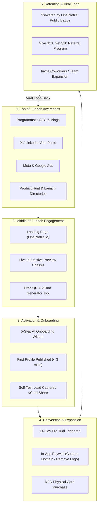

# 🚀 OneProfile - Complete Go-to-Market (GTM) Strategy

## 1. Executive Summary & GTM Vision
The goal of the OneProfile GTM Strategy is to establish market leadership in the fast-growing Digital Business Card & Micro-Site category ($1.2B TAM by 2028). The GTM playbook leverages a **Product-Led Growth (PLG)** model with a built-in viral distribution loop ("Powered by OneProfile" profile badges), paired with targeted **Outbound B2B Sales** for team accounts.

---

## 2. Branding & Messaging Framework

### Brand Tagline Options
- **Primary**: *"Your Digital Identity. Upgraded."*
- **Alternative (Sales-focused)**: *"Turn Profile Views into Paying Clients in 1 Tap."*
- **Alternative (Creator-focused)**: *"More than a link-in-bio. Your 5-minute digital mini-website."*

### Value Pillars & Messaging Matrix

| Audience Target | Primary Pain Point | Core Brand Message | Key Hook / Value Proposition |
| :--- | :--- | :--- | :--- |
| **Freelancers & Consultants** | Hard to showcase portfolio & book clients quickly. | *"Your mini-agency website, setup in 300 seconds."* | Free custom link + dynamic vCard + Calendly-style booking. |
| **B2B Sales Reps & Brokers** | 90% of paper cards get lost; manual CRM entry is slow. | *"Never lose a contact at a networking event again."* | 1-Tap NFC card sharing + instant reciprocal lead capture. |
| **Agencies & Enterprise Teams** | Brand fragmentation across employee profiles. | *"Centralized corporate identity for your entire workforce."* | Unified team dashboard, brand guidelines lock, SAML SSO. |

---

## 3. Pricing & Packaging Recommendations

To maximize acquisition velocity while driving high Customer Lifetime Value (LTV), we recommend a **Freemium + 14-Day Free Trial on Pro** model:

```
┌─────────────────────────┐  ┌─────────────────────────┐  ┌─────────────────────────┐  ┌─────────────────────────┐
│        STARTER          │  │       PRO (SOLO)        │  │     BUSINESS (SMB)      │  │     ENTERPRISE TEAM     │
│       $0 / month        │  │   $9/mo ($7/mo ann.)    │  │   $29/mo ($24/mo ann.)  │  │   $99/mo ($79/mo ann.)  │
├─────────────────────────┤  ├─────────────────────────┤  ├─────────────────────────┤  ├─────────────────────────┤
│ • 1 Digital Profile Card│  │ • Unlimited Profiles    │  │ • 5 Team Member Seats   │  │ • 25+ Team Member Seats │
│ • Standard QR Code      │  │ • Custom Domain (DNS)   │  │ • Team Lead CRM Sync    │  │ • Dedicated Account Mgr │
│ • vCard Download        │  │ • Lead Capture Form     │  │ • Custom NFC Card (x5)  │  │ • SAML SSO & SCIM Sync  │
│ • Basic Analytics       │  │ • Appointment Booking   │  │ • Remove OneProfile Logo│  │ • SLA & Custom Contracts│
│ • OneProfile Watermark  │  │ • Advanced Themes & CSS │  │ • Priority Support      │  │ • Bulk NFC Card Order   │
└─────────────────────────┘  └─────────────────────────┘  └─────────────────────────┘  └─────────────────────────┘
```

### Monetization Strategy & Add-ons
1. **Physical NFC Matte Metal / Bamboo Cards**: $29 – $49 one-time hardware purchase (Margin: ~65-75%).
2. **Custom Domain Add-on**: $3/mo for managed SSL & DNS routing on Starter profiles.
3. **Done-for-You Setup Service**: $99 one-time setup fee for busy executives (Includes custom branding, bio polishing, graphics).

---

## 4. Full Acquisition Funnel Architecture



---

## 5. Primary Distribution Channels Matrix

| Channel | Category | Target ROI | Effort | Description |
| :--- | :--- | :--- | :--- | :--- |
| **Viral Profile Badge** | Product Loop | Very High | Low | Every free profile includes a discrete footer: *"Powered by OneProfile • Create Yours Free"*. |
| **Product Hunt Launch** | Event Launch | High | Medium | Coordinated Day-1 launch to gain 500-1,000 signups in 24 hours. |
| **Cold Email & LinkedIn Outreach** | Outbound Sales | High | Medium-High | Target sales managers, real estate brokerages, agency owners with personalized video demos. |
| **Programmatic SEO** | Organic Search | High (Long-term)| Medium | Target keywords like *"Digital business card for realtors"*, *"Best Linktree alternative for consultants"*. |
| **Meta & TikTok UGC Video Ads** | Paid Marketing | Medium-High | Medium | Dynamic split-screen videos demonstrating "Paper card vs OneProfile 1-tap NFC tap". |
| **Affiliate & Micro-Influencers** | Partnerships | High | Medium | Offer 30% lifetime recurring commission to business coaches and sales trainers. |
