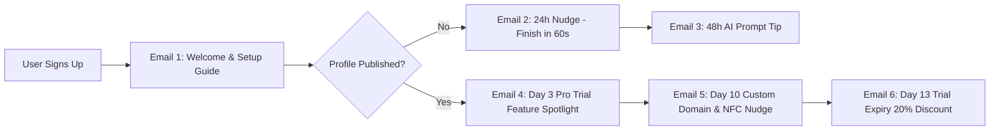

# 🌿 OneProfile - Organic Marketing & Viral Growth Strategy

## Executive Summary
Organic growth is the primary driver for achieving sustainable, low-CAC user acquisition for OneProfile. By leveraging built-in **product viral loops**, **programmatic SEO**, **niche community outreach**, and **Product Hunt momentum**, OneProfile can generate thousands of organic visitors every month without relying solely on paid ads.

---

## 1. Viral Growth Loops & Product-Led Growth (PLG)

OneProfile naturally benefits from a **two-sided network effect**: Every time a user shares their digital card or embeds it in their email signature/social bio, dozens of potential new users see the platform.

```
                  ┌─────────────────────────────────────────┐
                  │          User Shares Profile           │
                  │   (NFC Card, QR Code, Social Bio)       │
                  └────────────────────┬────────────────────┘
                                       │
                                       ▼
                  ┌─────────────────────────────────────────┐
                  │         Visitor Views Profile          │
                  │      (Experiences sleek UI & vCard)     │
                  └────────────────────┬────────────────────┘
                                       │
                                       ▼
                  ┌─────────────────────────────────────────┐
                  │    Sees Footer Badge or Lead Form       │
                  │  "Powered by OneProfile • Create Free"  │
                  └────────────────────┬────────────────────┘
                                       │
                                       ▼
                  ┌─────────────────────────────────────────┐
                  │     Visitor Clicks Badge & Signs Up     │
                  │       (Loop Completes & Multiplies)     │
                  └─────────────────────────────────────────┘
```

### Viral Loop Mechanisms
1. **Dynamic "Powered by OneProfile" Footer Badge**:
   - Every free user profile includes a subtle, stylish badge in the footer.
   - Links directly to `https://oneprofile.io?ref=viral_badge&user_id=:id`.
   - Incentive: Removing the badge requires upgrading to the Pro plan ($9/mo), driving immediate monetization if the user wants custom branding.

2. **Email Signature Generator**:
   - Provide users with an instant 1-click HTML Email Signature tool inside their dashboard (`apps/web`).
   - Includes user avatar, title, phone, and a button: *"View My Interactive Digital Business Card"*.
   - Generates passive viral impressions across thousands of recipient inboxes daily.

3. **Give $10, Get $10 Referral Program**:
   - Give existing users $10 credit (or 1 month free Pro) for every friend who publishes a profile.

---

## 2. SEO & Programmatic Content Strategy

### High-Intent Keyword Targeting Matrix

| Keyword Category | Target Search Keywords | Monthly Volume | Intent Level | Page Type |
| :--- | :--- | :--- | :--- | :--- |
| **High-Intent Product** | `digital business card for realtors` | 8,100 | High | Landing Page Template |
| **High-Intent Product** | `linktree alternative with lead capture` | 4,400 | High | Competitor Alternative Page |
| **Comparison** | `popl vs hihello vs oneprofile` | 2,900 | High | Comparison Blog |
| **Tool / Utility** | `free vcard generator online` | 18,200 | Medium | Interactive Tool Page |
| **Tool / Utility** | `free nfc card profile builder` | 6,500 | High | Interactive Tool Page |

### Programmatic SEO Architecture
Build dynamic landing pages targeting 50+ industries using a structured template:
- URL Pattern: `/for/:industry` (e.g., `/for/real-estate-agents`, `/for/consultants`, `/for/fitness-coaches`, `/for/lawyers`)
- Content Structure:
  - Custom Hero: *"The #1 Digital Business Card for [Industry]"*
  - Pre-filled template preview with industry-specific links & contact fields.
  - Testimonial from a professional in that industry.
  - 1-Click "Use This Template" button that pre-populates the Onboarding Wizard.

---

## 3. Product Hunt Launch Master Playbook

### Pre-Launch Preparation (T-14 Days to T-1 Day)
- [ ] Claim Product Hunt ship page and build an upcoming teaser page.
- [ ] Prepare crisp graphic assets:
  - 1 Thumbnail GIF (240x240) showing NFC card tap animation.
  - 5 High-res screenshots showcasing the wizard, theme builder, lead form, and mobile view.
- [ ] Write First Maker Comment: Detail *Why we built OneProfile*, *Our story*, and *Special Product Hunt Offer (30 Days Free Pro)*.
- [ ] Warm up network of 250+ founders, marketers, and tech enthusiasts on LinkedIn/X.

### Launch Day Execution Schedule (T-0 Hours)
- **00:01 PST**: Go Live! Post maker comment.
- **00:30 PST**: Send broadcast email to early waitlist (1,000+ contacts).
- **06:00 PST**: Post launch announcements on LinkedIn, X/Twitter, Reddit (r/SideProject, r/SaaS), Product Hunt discussion forums.
- **12:00 PST**: Half-way check: Post live stats update on X ("Currently #3 Product of the Day with 240 upvotes!").
- **18:00 PST**: Final push across indie hacker communities.

---

## 4. Platform-Specific Community Growth Playbook

### Reddit Growth SOP
- **Subreddits**: r/SaaS, r/SideProject, r/Entrepreneur, r/Freelance, r/RealEstate.
- **Content Format**: Non-salesy, story-driven posts.
- **Sample Hook**: *"I spent 3 months building an AI tool that turns boring Linktree lists into full 5-minute digital mini-websites with built-in lead forms. Here are my raw conversion numbers."*

### LinkedIn Organic SOP
- **Target Audience**: Consultants, Agency Founders, Sales VP, Brokers.
- **Posting Frequency**: 5x / week.
- **Content Pillars**:
  1. Networking Hacks & Sales Pipeline Optimization.
  2. Product Updates & Visual UI Demos (Framer Motion GIFs).
  3. Startup Founder Journey & Building in Public.

### X (Twitter) Build in Public SOP
- **Posting Frequency**: 2-3 tweets / day + 1 weekly thread.
- **Format**: Share metrics, code snippets (React + Node monorepo setup), UI iterations, and growth experiments.

---

## 5. Automated Email Marketing Sequences



### Email 1: Welcome & Magic Moment (Trigger: Immediate)
- **Subject**: Welcome to OneProfile! 🚀 Build your digital card in 3 minutes
- **Body Summary**: Welcomes user, gives quick 1-2-3 setup steps, provides direct link to Onboarding Wizard (`/onboarding`).

### Email 2: Unpublished Nudge (Trigger: 24h after signup if no profile published)
- **Subject**: Your profile is almost ready, [FirstName]...
- **Body Summary**: Shows preview of how sleek their card will look. Adds 1-click button to resume draft.

### Email 3: Pro Feature Spotlight (Trigger: Day 4 after publication)
- **Subject**: Turn your profile views into paying clients 📈
- **Body Summary**: Explains how enabling the Lead Capture Form and Appointment Scheduler increases client conversions by 3x. Includes Pro upgrade CTA.

### Email 4: Special Upgrade Offer (Trigger: Day 13 - Trial Expiry)
- **Subject**: 48 Hours Left: Unlock Custom Domain + Remove Branding
- **Body Summary**: Offers 20% off annual plan (`ONEPROFILE20`) before trial ends.
